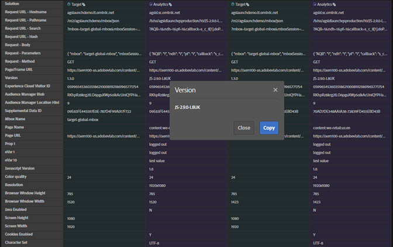

# 네트워크 정보{#network-information}

네트워크 정보를 보려면 **[!UICONTROL Network]**&#x200B;를 클릭합니다.

네트워크 화면은 페이지에서 수행된 모든 Adobe Experience Cloud 솔루션 호출을 집계하여 왼쪽에서 오른쪽으로 표시합니다. 표준 매개 변수는 친숙한 이름으로 자동으로 레이블이 지정되며, 동일한 역할에 따라 일반 매개 변수를 그룹화하여 정렬됩니다.

>[!TIP]
>
>이 화면은 Experience Cloud 방문자 ID 또는 추가 데이터 ID와 같이 통합에 사용된 매개 변수가 통합에서 일관되는지 확인하는 데 유용합니다.

>[!NOTE]
>
>현재 솔루션 호출에서 전달된 모든 매개 변수(예: Analytics 컨텍스트 변수, Target 사용자 지정 매개 변수 또는 Experience Cloud ID 서비스 고객 ID)가 네트워크 화면에 표시되는 것은 아닙니다.

모든 정보를 보려면 **[!UICONTROL All]**&#x200B;을 선택합니다.

솔루션별로 정보를 필터링할 수도 있습니다. 보려는 솔루션을 선택합니다. 여러 솔루션을 동시에 볼 수 있습니다. 선택한 솔루션 필터가 강조 표시됩니다.

네트워크 보기에서 한 항목을 클릭하면 더 크게 표시됩니다. 확장된 보기 창에서 표시된 정보를 클립보드에 복사할 수 있습니다.

각 열 맨 위에 있는 아이콘을 사용하여 서버 호출 URL을 클립보드에 복사합니다. 이 URL을 참조나 디버깅 목적으로 다른 문서에 붙여넣을 수 있습니다.

