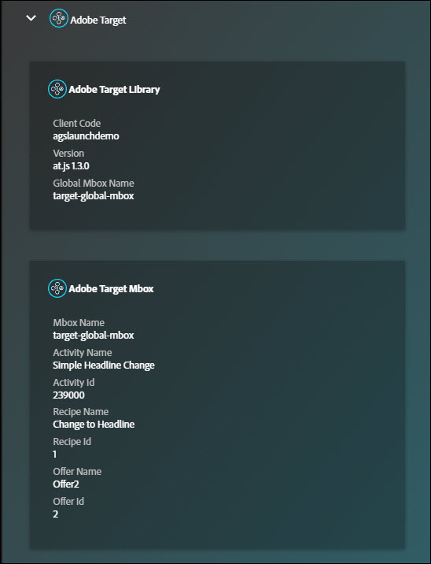

# 요약 화면{#summary-screen}

Experience Cloud Debugger를 실행하려면 확장 프로그램 모음에서 확장 프로그램 아이콘을 클릭한 다음 Chrome에서 검사할 페이지를 엽니다.

Adobe Experience Cloud 디버거 요약 화면이 표시됩니다.

이 화면에는 페이지의 축소판뿐만 아니라 페이지의 URL과 제목이 표시됩니다. 또한 각 Adobe Experience Cloud 솔루션에 대한 정보가 표시됩니다. 표시되는 정보는 솔루션마다 다르지만, 일반적으로 솔루션 라이브러리 및 버전(예: &quot;AppMeasurement v2.9&quot;)과 계정 식별자(예: Analytics 보고서 세트 ID, Target 클라이언트 코드, Audience Manager 파트너 ID 등) 등의 정보를 포함합니다.

창 위쪽에 있는 탭 옆의 파란색 숫자는 수행된 서버 호출 수를 나타냅니다. 각 탭 내에서 **[!UICONTROL Clear All Requests]**&#x200B;를 클릭하여 이러한 수를 0으로 재설정할 수 있습니다.

예를 들어 다음 이미지는 Adobe Target에 대한 정보를 보여줍니다. 인증 없이 아래에 나와 있는 활동 세부 정보를 표시하려면 코드 또는 태그 관리자에서 디버깅 이벤트 리스너를 구현하고 Target UI에서 필요한 [응답 토큰](https://docs.adobe.com/content/help/ko-KR/target/using/administer/response-tokens.html)을 켜야 합니다.

## Auditor에서 감사 실행 {#section-82bc57440406461ebf27a16855b71655}

Adobe Auditor를 사용하여 페이지에서 일련의 감사를 실행할 수 있습니다. Auditor를 실행하려면 상단 메뉴에서 **[!UICONTROL Auditor]**&#x200B;를 클릭한 다음 **[!UICONTROL Audit Page Now]**&#x200B;를 클릭합니다. Adobe Auditor를 열려면 **[!UICONTROL Run Multi-Page Audit Now]**&#x200B;를 클릭합니다.

## 디버거에 표시된 정보 {#section-88a95ba53dca43d9b96a585e75e5f5cf}

디버거에는 각 솔루션에 대한 다음 정보가 표시됩니다.

**페이지 정보**

<table id="table_FF3B9083524244D29AF350978A0AC236"> 
 <tbody> 
  <tr> 
   <td colname="col1"> 
페이지 스크린샷 
 </td> 
   <td colname="col2"> 
페이지의 축소판 
 </td> 
  </tr> 
  <tr> 
   <td colname="col1"> 
URL 
 </td> 
   <td colname="col2"> 
페이지의 URL 
 </td> 
  </tr> 
  <tr> 
   <td colname="col1"> 
Title 
 </td> 
   <td colname="col2"> 
 &lt;TITLE&gt; 태그에 지정된 이름 
 </td> 
  </tr> 
 </tbody> 
</table>

**Adobe Analytics**

<table id="table_BEB9CC58E59D4D86BC895A8A51D84A2C"> 
 <tbody> 
  <tr> 
   <td colname="col1"> 
보고서 세트 
 </td> 
   <td colname="col2"> 
<a href="https://docs.adobe.com/content/help/ko-KR/analytics/admin/manage-report-suites/report-suites-admin.html" format="html" scope="external">보고서 세트</a>는 선택한 웹 사이트, 웹 사이트 집합 또는 웹 페이지의 하위 집합에 대한 전체적이고 독립적인 보고를 정의합니다 
 </td> 
  </tr> 
  <tr> 
   <td colname="col1"> 
버전 
 </td> 
   <td colname="col2"> 
페이지에 대해 정의된 <a href="https://docs.adobe.com/content/help/ko-KR/analytics/implementation/js/overview.html" format="html" scope="external"> AppMeasurement</a> 버전입니다. 
 </td> 
  </tr> 
  <tr> 
   <td colname="col1"> 
방문자 버전 
 </td> 
   <td colname="col2"> 
<a href="https://docs.adobe.com/content/help/ko-KR/analytics/technotes/visitor-identification.html" format="html" scope="external"> 방문자 ID</a> 라이브러리의 버전입니다. 
 </td> 
  </tr> 
  <tr> 
   <td colname="col1"> 
페이지 이름 
 </td> 
   <td colname="col2"> 
Analytics로 보낸 <a href="https://docs.adobe.com/content/help/ko-KR/analytics/implementation/vars/page-vars/page-variables.html" format="html" scope="external"> pageName</a> 변수로, 사이트에 대한 친화적인 이름이 들어 있습니다. 
 </td> 
  </tr> 
  <tr> 
   <td colname="col1"> 
모듈 
 </td> 
   <td colname="col2"> 
Adobe Analytics에서 로드한 모듈입니다. 
 </td> 
  </tr> 
 </tbody> 
</table>

**Audience Manager**

<table id="table_784AEABADBDA4D14BB9A7A9CB9EF07C3"> 
 <tbody> 
  <tr> 
   <td colname="col1"> 
파트너 
 </td> 
   <td colname="col2"> 
DIL 인스턴스에 대한 <a href="https://docs.adobe.com/content/help/ko-KR/audience-manager/user-guide/dil-api/dil-instance-methods.html#getpartner" format="html" scope="external"> 파트너 이름</a>입니다. 
 </td> 
  </tr> 
  <tr> 
   <td colname="col1"> 
버전 
 </td> 
   <td colname="col2"> 
DIL 인스턴스에 대한 <a href="https://docs.adobe.com/content/help/ko-KR/audience-manager/user-guide/api-and-sdk-code/rest-apis/aam-api-dil-methods.html#return-version-dil" format="html" scope="external"> 버전 번호</a>입니다. 
 </td> 
  </tr> 
  <tr> 
   <td colname="col1"> 
UUID 
 </td> 
   <td colname="col2"> 
DIL 인스턴스와 연결된 <a href="https://docs.adobe.com/content/help/ko-KR/audience-manager/user-guide/reference/ids-in-aam.html" format="html" scope="external"> 고유 사용자 ID</a>입니다. 
 </td> 
  </tr> 
 </tbody> 
</table>

**Adobe Launch**

<table id="table_E9574975444A407887E26514D1BB1601"> 
 <tbody> 
  <tr> 
   <td colname="col1"> 
이름 
 </td> 
   <td colname="col2"> 
Adobe Launch <a href="https://docs.adobe.com/content/help/ko-KR/launch/using/reference/admin/companies-and-properties.html" format="https" scope="external"> 속성</a> 이름입니다. 
 </td> 
  </tr> 
  <tr> 
   <td colname="col1"> 
버전 
 </td> 
   <td colname="col2"> 
<a href="https://developer.adobelaunch.com/extensions/reference/turbine-free-variable/" format="https" scope="external"> Turbine</a> 버전입니다. 
 </td> 
  </tr> 
  <tr> 
   <td colname="col1"> 
빌드 날짜 
 </td> 
   <td colname="col2"> 
Launch <a href="https://docs.adobe.com/content/help/ko-KR/launch/using/reference/publish/libraries.html" format="https" scope="external"> 라이브러리</a> 빌드 날짜입니다. 
 </td> 
  </tr> 
  <tr> 
   <td colname="col1"> 
환경 
 </td> 
   <td colname="col2"> 
Launch 라이브러리에서 사용하는 <a href="https://docs.adobe.com/content/help/ko-KR/launch/using/reference/publish/environments.html" format="https" scope="external"> 환경</a>입니다. 
 </td> 
  </tr> 
  <tr> 
   <td colname="col1"> 
스크립트 디렉토리 
 </td> 
   <td colname="col2"> 
Launch 스크립트가 저장되는 디렉토리입니다. 
 </td> 
  </tr> 
 </tbody> 
</table>

**Adobe DTM**

<table id="table_DC76D63FA6EF4891906B9E1D3E4A8A6C"> 
 <tbody> 
  <tr> 
   <td colname="col1"> 
라이브러리 이름 
 </td> 
   <td colname="col2"> 
Adobe DTM<a href="https://docs.adobe.com/content/help/ko-KR/dtm/using/library-management.html" format="html" scope="external"> 라이브러리</a>의 이름입니다. 
 </td> 
  </tr> 
  <tr> 
   <td colname="col1"> 
버전 
 </td> 
   <td colname="col2"> 
Turbine 버전입니다. 
 </td> 
  </tr> 
  <tr> 
   <td colname="col1"> 
빌드 날짜 
 </td> 
   <td colname="col2"> 
Launch <a href="https://docs.adobe.com/content/help/ko-KR/dtm/using/library-management.html" format="html" scope="external"> 라이브러리</a> 빌드 날짜입니다. 
 </td> 
  </tr> 
  <tr> 
   <td colname="col1"> 
환경 
 </td> 
   <td colname="col2"> 
Launch 라이브러리에서 사용하는 환경입니다. 
 </td> 
  </tr> 
  <tr> 
   <td colname="col1"> 
스크립트 디렉토리 
 </td> 
   <td colname="col2"> 
DTM 스크립트가 저장되는 디렉토리입니다. 
 </td> 
  </tr> 
 </tbody> 
</table>

**Adobe Experience Cloud ID 서비스**

<table id="table_274CFCEFA8F34D16BB546B4669EC0209"> 
 <tbody> 
  <tr> 
   <td colname="col1"> 
Experience Cloud 조직 ID 
 </td> 
   <td colname="col2"> 
<a href="https://docs.adobe.com/content/help/ko-KR/id-service/using/home.html" format="https" scope="external"> 조직 ID</a>입니다. 
 </td> 
  </tr> 
  <tr> 
   <td colname="col1"> 
버전 
 </td> 
   <td colname="col2"> 
<a href="https://docs.adobe.com/content/help/ko-KR/analytics/technotes/visitor-identification.html" format="html" scope="external"> 방문자 ID</a> 라이브러리의 버전입니다. 
 </td> 
  </tr> 
 </tbody> 
</table>

**Adobe Target**

<table id="table_D30E0CD20FB04E41862B22655136E043"> 
 <tbody> 
  <tr> 
   <td colname="col1"> 
클라이언트 코드 
 </td> 
   <td colname="col2"> 
Target <a href="https://docs.adobe.com/content/help/ko-KR/target/using/implement-target/client-side/deploy-at-js/implementing-target-without-a-tag-manager.html" format="html" scope="external"> 클라이언트 코드 </a>입니다. 
 </td> 
  </tr> 
  <tr> 
   <td colname="col1"> 
버전 
 </td> 
   <td colname="col2"> 
현재 <a href="https://docs.adobe.com/content/help/ko-KR/target/using/implement-target/client-side/target-atjs-versions.html" format="html" scope="external"> at.js</a> 또는 mbox.js 버전입니다. 
 </td> 
  </tr> 
  <tr> 
   <td colname="col1"> 
글로벌 Mbox 이름 
 </td> 
   <td colname="col2"> 
<a href="https://docs.adobe.com/help/ko-KR/target/using/implement-target/client-side/mbox-implement/global-mbox/understanding-global-mbox.html" format="html" scope="external"> 글로벌 mbox</a>는 Target 구현의 각 웹 페이지 맨 위에서 수행된 단일 서버 호출을 나타냅니다. 
 </td> 
  </tr> 
  <tr> 
   <td colname="col1"> 
Mbox 이름 
 </td> 
   <td colname="col2"> 
페이지에서 <a href="https://docs.adobe.com/content/help/ko-KR/target/using/implement-target/client-side/mbox-implement/global-mbox/understanding-global-mbox.html" format="html" scope="external"> 위치</a> 주위에 있는 mbox 이름입니다. 코드 또는 태그 관리자에서 디버깅 이벤트 리스너를 구현하고 Target UI에서 필요한 <a href="https://docs.adobe.com/content/help/ko-KR/target/using/administer/response-tokens.html" format="html" scope="external"> 응답 토큰</a>을 켜는 경우에만 인증 없이 사용할 수 있습니다. 
 </td> 
  </tr> 
  <tr> 
   <td colname="col1"> 
활동 이름 
 </td> 
   <td colname="col2"> 
Target <a href="https://docs.adobe.com/content/help/ko-KR/target/using/activities/activities.html" format="html" scope="external"> 캠페인 또는 활동</a>의 이름입니다. 코드 또는 태그 관리자에서 디버깅 이벤트 리스너를 구현하고 Target UI에서 필요한 <a href="https://docs.adobe.com/content/help/ko-KR/target/using/administer/response-tokens.html" format="html" scope="external"> 응답 토큰</a>을 켜는 경우에만 인증 없이 사용할 수 있습니다. 
 </td> 
  </tr> 
  <tr> 
   <td colname="col1"> 
활동 ID 
 </td> 
   <td colname="col2"> 
Target 활동의 ID입니다. 코드 또는 태그 관리자에서 디버깅 이벤트 리스너를 구현하고 Target UI에서 필요한 <a href="https://docs.adobe.com/content/help/ko-KR/target/using/administer/response-tokens.html" format="html" scope="external"> 응답 토큰</a>을 켜는 경우에만 인증 없이 사용할 수 있습니다. 
 </td> 
  </tr> 
  <tr> 
   <td colname="col1"> 
레서피 이름 
 </td> 
   <td colname="col2"> 
Target <a href="https://docs.adobe.com/content/help/ko-KR/target/using/experiences/experiences.html" format="html" scope="external"> 경험</a>의 이름입니다. 코드 또는 태그 관리자에서 디버깅 이벤트 리스너를 구현하고 Target UI에서 필요한 <a href="https://docs.adobe.com/content/help/ko-KR/target/using/administer/response-tokens.html" format="html" scope="external"> 응답 토큰</a>을 켜는 경우에만 인증 없이 사용할 수 있습니다. 
 </td> 
  </tr> 
  <tr> 
   <td colname="col1"> 
레서피 ID 
 </td> 
   <td colname="col2"> 
Target 레서피의 ID입니다. 코드 또는 태그 관리자에서 디버깅 이벤트 리스너를 구현하고 Target UI에서 필요한 <a href="https://docs.adobe.com/content/help/ko-KR/target/using/administer/response-tokens.html" format="html" scope="external"> 응답 토큰</a>을 켜는 경우에만 인증 없이 사용할 수 있습니다. 
 </td> 
  </tr> 
  <tr> 
   <td colname="col1"> 
오퍼 
 </td> 
   <td colname="col2"> 
Target <a href="https://docs.adobe.com/content/help/ko-KR/target/using/experiences/offers/manage-content.html" format="html" scope="external"> 오퍼</a>의 이름입니다. 코드 또는 태그 관리자에서 디버깅 이벤트 리스너를 구현하고 Target UI에서 필요한 <a href="https://docs.adobe.com/content/help/ko-KR/target/using/administer/response-tokens.html" format="html" scope="external"> 응답 토큰</a>을 켜는 경우에만 인증 없이 사용할 수 있습니다. 
 </td> 
  </tr> 
  <tr> 
   <td colname="col1"> 
오퍼 ID 
 </td> 
   <td colname="col2"> 
Target 오퍼의 ID입니다. 코드 또는 태그 관리자에서 디버깅 이벤트 리스너를 구현하고 Target UI에서 필요한 <a href="https://docs.adobe.com/content/help/ko-KR/target/using/administer/response-tokens.html" format="html" scope="external"> 응답 토큰</a>을 켜는 경우에만 인증 없이 사용할 수 있습니다. 
 </td> 
  </tr> 
 </tbody> 
</table>

