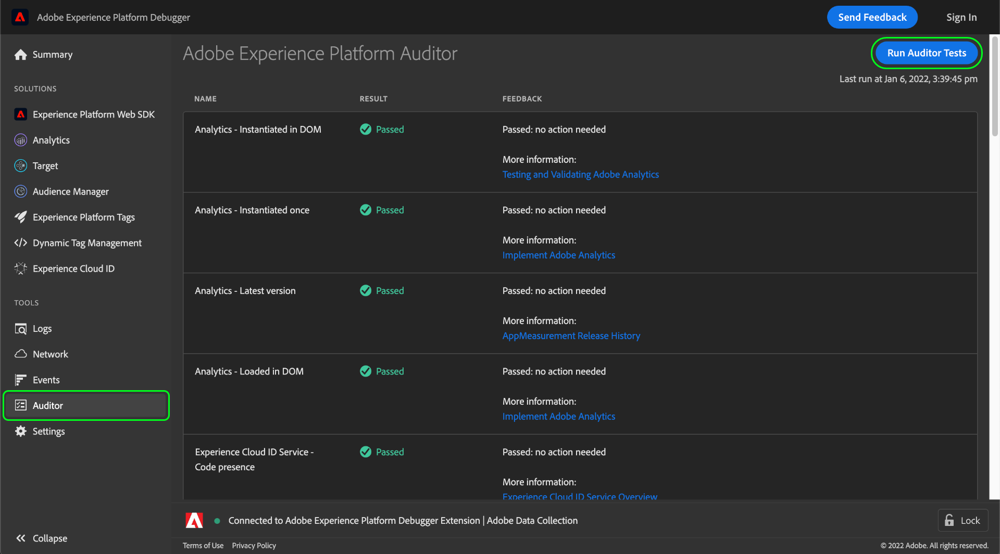

# Auditor 탭

Adobe Experience Platform Debugger에서 **[!UICONTROL Auditor]** 탭에서 페이지에 대한 일련의 감사 테스트를 실행합니다.

이 기능을 사용하려면 다음 작업을 수행하십시오.

1. 선택 **[!UICONTROL Auditor]** 왼쪽 탐색.
1. **[!UICONTROL Run Auditor Tests]**&#x200B;를 선택합니다. 테스트가 완료되면 결과는 아래에 표시됩니다.

결과 목록에 테스트와 해당 결과가 표시되고 문제 해결을 위한 제안 사항이 제공됩니다.

## 테스트 결과 해석

각 테스트에 가중치가 적용되며 테스트 점수는 할당된 가중치와 같습니다. 가중치가 5인 테스트에 통과하면 5점을 받습니다.

| 점수 | 설명 |
| --- | --- |
| 0 | 인지해야 하는 문제에 대해 경고하지만 점수에 영향을 주지 않습니다. |
| 1 | 최적화를 권장합니다. 데이터 정확성에 영향을 주지 않습니다. |
| 2 | 이 테스트가 실패하면 Adobe Experience Cloud의 최신 기능 및 수정 사항에 액세스할 수 없게 됩니다. |
| 3 | 효율성 및 구현이 우수 사례를 따르는지 여부를 테스트합니다. |
| 4 | 장애는 신뢰할 수 없는 데이터를 수집했음을 의미합니다. |
| 5 | 장애는 데이터 손실이 발생할 수 있음을 의미합니다. |

모든 테스트는 통과 또는 실패입니다. 테스트 조건의 준수 여부를 테스트하므로 부분적인 준수에 대한 부분 점수는 없습니다. 예를 들어, 테스트에서 최신 버전의 Adobe 솔루션을 확인했는데 한 버전만 뒤처진 경우, 다섯 버전 뒤처진 것과 동일한 점수를 받게 됩니다. 최신 버전에는 성능 향상 및 버그 수정이 포함되어 있으므로 최신 버전을 사용하는 것이 좋습니다.

레벨 4 또는 5 결과를 수정하는 것이 **좋습니다**.

레벨 1-3 결과를 수정하는 것이 **좋습니다**.

## 지원되는 Adobe 기술

Auditor 기능은 다음 Adobe 기술에 등급을 지정할 수 있습니다.

* Adobe Advertising Cloud DSP
* Adobe Advertising Cloud Search
* Adobe Analytics
* Adobe Experience Cloud ID 서비스
* Adobe Target
* 태그(이전 Adobe Experience Platform Launch)

## 테스트 지침

이 기능에서 제공하는 테스트 규칙에 대한 자세한 내용은 다음 문서를 참조하십시오.

* [태그 일관성](./tag-consistency.md)
* [태그 유무](./tag-presence.md)
* [구성](./configuration.md)
* [경고](./alerts.md)
