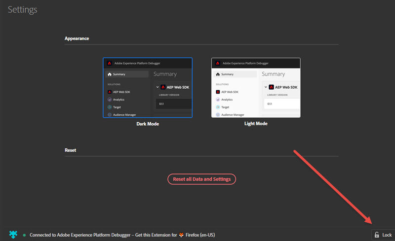

# Debugger 구성

>[!IMPORTANT]
>
>Adobe Experience Platform Debugger는 현재 베타 버전입니다. 설명서 및 기능은 변경될 수 있습니다.

Experience Platform Debugger가 표시되고 작동하는 방식에 대한 특정 측면을 구성할 수 있습니다.

## 밝은 모드 또는 어두운 모드

Platform Debugger가 열린 후 **[!UICONTROL Settings]**&#x200B;으로 이동하여 **어두운 모드**(기본값) 또는 **밝은 모드**&#x200B;를 선택하면 기본 설정 모양을 선택할 수 있습니다.

## 재설정

모든 데이터를 지우고 기본 설정으로 돌아가려면 **[!UICONTROL Reset all Data and Settings]**&#x200B;을 클릭합니다.

## 하나의 페이지에서 Experience Platform Debugger 잠금

사이트의 페이지를 변경하면 Experience Platform Debugger 창이 업데이트되어 해당 페이지에 대한 정보를 보여줍니다. 연결된 페이지의 이름이 화면 맨 아래에 표시됩니다. 한 페이지에서 Platform Debugger를 잠금으로 유지하려면 Experience Platform Debugger 창의 오른쪽 아래 모서리에 있는 **[!UICONTROL Lock]**&#x200B;을 클릭합니다.

이 기능은 페이지를 디버깅하는 동안 설명서를 읽거나 다른 페이지에서 정보를 보는 경우에 유용합니다.