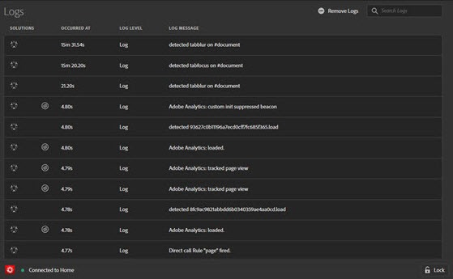

# 로그{#logs}

로그 화면에서는 DTM 구현에 관련된 정보를 제공합니다. 이 정보를 표시하기 위해 DTM용 콘솔 디버깅 도구를 활성화하지 않아도 됩니다. 관련된 DTM 도구를 통해 구현된 솔루션별로 필터링할 수 있습니다.

[로그] 화면에는 다음 네 개의 열에 대한 정보가 표시됩니다.

**[!UICONTROL Solutions]** :기록된 항목의 영향을 받는 Experience Cloud 솔루션에 대한 아이콘을 표시합니다. 아이콘 위로 마우스를 가져가면 텍스트 설명이 표시됩니다.

**[!UICONTROL Occurred at]** :세션 중에 기록된 문제가 발생한 시기를 표시합니다.

**[!UICONTROL Log level]** :문제 심각도를 표시합니다. 심각도는 다음 수준 중 하나입니다.

* 로그
* 정보
* 경고
* 오류

**[!UICONTROL Log message]** :문제를 설명합니다.

일부 로그 메시지에는 코드 표시 옵션이 포함되어 있습니다. Click **[!UICONTROL Show Code]** to view the conditional code that determines whether a rule should fire.

로그를 지우려면 을 클릭합니다 **[!UICONTROL Remove Logs]**.
