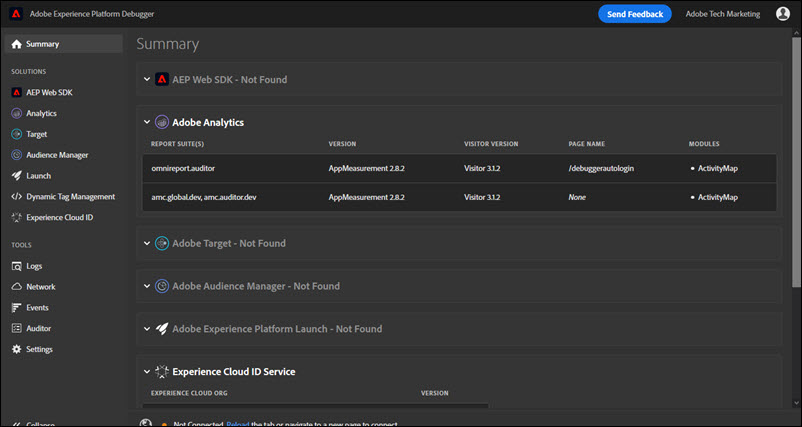

# 요약 화면{#summary-screen}

>[!IMPORTANT]
>
>Adobe Experience Platform Debugger는 현재 베타 버전입니다. 설명서 및 기능은 변경될 수 있습니다.

Adobe Experience Platform Debugger를 실행하려면 브라우저 표시줄에서 아이콘을 클릭한 다음 브라우저에서 검사할 페이지를 엽니다.

Adobe Experience Platform Debugger 요약 화면이 표시됩니다.

이 화면에서는 각 Adobe Experience Cloud 솔루션에 대한 정보를 보여 줍니다. 표시되는 정보는 솔루션마다 다르지만, 일반적으로 솔루션 라이브러리 및 버전(예: &quot;AppMeasurement v2.9&quot;)과 계정 식별자(예: Analytics 보고서 세트 ID, Target 클라이언트 코드, Audience Manager 파트너 ID 등) 등의 정보를 포함합니다.

## Experience Platform Debugger에 표시된 정보

Experience Platform Debugger에는 각 솔루션에 대한 다음 정보가 표시됩니다.

**Adobe Analytics**

<table id="table_BEB9CC58E59D4D86BC895A8A51D84A2C"> 
 <tbody> 
  <tr> 
   <td colname="col1"> 
보고서 세트 
 </td> 
   <td colname="col2"> 
<a href="https://experiencecloud.adobe.com/resources/help/ko_KR/reference/report_suites_admin.html" format="html" scope="external">보고서 세트</a>는 선택한 웹 사이트, 웹 사이트 집합 또는 웹 페이지의 하위 집합에 대한 전체적이고 독립적인 보고를 정의합니다 
 </td> 
  </tr> 
  <tr> 
   <td colname="col1"> 
버전 
 </td> 
   <td colname="col2"> 
페이지에 대해 정의된 <a href="https://experiencecloud.adobe.com/resources/help/ko_KR/sc/implement/appmeasure_mjs.html" format="html" scope="external"> AppMeasurement</a> 버전입니다. 
 </td> 
  </tr> 
  <tr> 
   <td colname="col1"> 
방문자 버전 
 </td> 
   <td colname="col2"> 
<a href="https://experiencecloud.adobe.com/resources/help/ko_KR/sc/implement/visid_analytics.html" format="html" scope="external"> 방문자 ID</a> 라이브러리의 버전입니다. 
 </td> 
  </tr> 
  <tr> 
   <td colname="col1"> 
페이지 이름 
 </td> 
   <td colname="col2"> 
Analytics로 보낸 <a href="https://experiencecloud.adobe.com/resources/help/ko_KR/sc/implement/pageName.html" format="html" scope="external"> pageName</a> 변수로, 사이트에 대한 친화적인 이름이 들어 있습니다. 
 </td> 
  </tr> 
  <tr> 
   <td colname="col1"> 
모듈 
 </td> 
   <td colname="col2"> 
Adobe Analytics에서 로드한 모듈입니다. 
 </td> 
  </tr> 
 </tbody> 
</table>

**Audience Manager**

<table id="table_784AEABADBDA4D14BB9A7A9CB9EF07C3"> 
 <tbody> 
  <tr> 
   <td colname="col1"> 
파트너 
 </td> 
   <td colname="col2"> 
DIL 인스턴스에 대한 <a href="https://experiencecloud.adobe.com/resources/help/ko_KR/aam/r_dil_get_partner.html" format="html" scope="external"> 파트너 이름</a>입니다. 
 </td> 
  </tr> 
  <tr> 
   <td colname="col1"> 
버전 
 </td> 
   <td colname="col2"> 
DIL 인스턴스에 대한 <a href="https://experiencecloud.adobe.com/resources/help/ko_KR/aam/r_api_return_versions_dil.html" format="html" scope="external"> 버전 번호</a>입니다. 
 </td> 
  </tr> 
  <tr> 
   <td colname="col1"> 
UUID 
 </td> 
   <td colname="col2"> 
DIL 인스턴스와 연결된 <a href="https://experiencecloud.adobe.com/resources/help/ko_KR/aam/ids-in-aam.html" format="html" scope="external"> 고유 사용자 ID</a>입니다. 
 </td> 
  </tr> 
 </tbody> 
</table>

**Adobe Experience Platform Launch**

<table id="table_E9574975444A407887E26514D1BB1601"> 
 <tbody> 
  <tr> 
   <td colname="col1"> 
이름 
 </td> 
   <td colname="col2"> 
Platform Launch <a href="https://docs.adobe.com/content/help/ko/launch/using/reference/admin/companies-and-properties.html" format="https" scope="external"> 속성</a> 이름입니다. 
 </td> 
  </tr> 
  <tr> 
   <td colname="col1"> 
버전 
 </td> 
   <td colname="col2"> 
Turbine 버전입니다.</a> 
 </td> 
  </tr> 
  <tr> 
   <td colname="col1"> 
빌드 날짜 
 </td> 
   <td colname="col2"> 
Platform Launch <a href="https://docs.adobe.com/content/help/ko/launch/using/reference/publish/libraries.html" format="https" scope="external"> 라이브러리</a> 빌드 날짜입니다. 
 </td> 
  </tr> 
  <tr> 
   <td colname="col1"> 
환경 
 </td> 
   <td colname="col2"> 
Platform Launch 라이브러리에서 사용하는 <a href="https://docs.adobe.com/content/help/ko/launch/using/reference/publish/environments.html" format="https" scope="external"> 환경</a>입니다. 
 </td> 
  </tr> 
  <tr> 
   <td colname="col1"> 
확장 
 </td> 
   <td colname="col2"> 
페이지에서 사용되는 확장 프로그램 
 </td> 
  </tr> 
 </tbody> 
</table>

**Adobe Experience Platform 웹 SDK**

<table id="table_DC76D63FA6EF4891906B9E1D3E4A8A6C"> 
 <tbody> 
  <tr> 
   <td colname="col1"> 
라이브러리 버전 
 </td> 
   <td colname="col2"> 
Adobe Experience Platform 웹 SDK <a href="https://docs.adobe.com/content/help/ko/launch/using/extensions-ref/adobe-extension/aep-extension/overview.html" format="html" scope="external">라이브러리 버전</a>의 번호 
 </td> 
  </tr> 
  <tr> 
   <td colname="col1"> 
네임스페이스
 </td> 
   <td colname="col2"> 
확장 프로그램에서 식별된 이름
 </td> 
  </tr> 
  <tr> 
   <td colname="col1"> 
속성 ID 
 </td> 
   <td colname="col2"> 
확장 프로그램에 지정된 Platform Launch 속성의 이름 
 </td> 
  </tr> 
  <tr> 
   <td colname="col1"> 
Edge 도메인 
 </td> 
   <td colname="col2"> 
Adobe Experience Platform 확장 프로그램에서 데이터를 보내고 받는 도메인입니다 
 </td> 
  </tr> 
  <tr> 
   <td colname="col1"> 
IMS 조직 ID 
 </td> 
   <td colname="col2"> 
확장 프로그램에 지정된 대로 Adobe에서 데이터를 전송하려는 조직 
 </td> 
  </tr> 
  <tr> 
   <td colname="col1"> 
로깅 활성화됨 
 </td> 
   <td colname="col2"> 
이 속성에 대해 로깅을 활성화했는지 아닌지를 지정합니다
 </td> 
  </tr> 
 </tbody> 
</table>

**Adobe Experience Cloud ID 서비스**

<table id="table_274CFCEFA8F34D16BB546B4669EC0209"> 
 <tbody> 
  <tr> 
   <td colname="col1"> 
Experience Cloud 조직 ID 
 </td> 
   <td colname="col2"> 
<a href="https://experiencecloud.adobe.com/resources/help/ko_KR/mcvid/" format="https" scope="external"> 조직 ID</a>입니다. 
 </td> 
  </tr> 
  <tr> 
   <td colname="col1"> 
버전 
 </td> 
   <td colname="col2"> 
<a href="https://experiencecloud.adobe.com/resources/help/en_US/sc/implement/visid_analytics.html" format="html" scope="external"> 방문자 ID</a> 라이브러리의 버전입니다. 
 </td> 
  </tr> 
 </tbody> 
</table>

**Adobe Target**

<table id="table_D30E0CD20FB04E41862B22655136E043"> 
 <tbody> 
  <tr> 
   <td colname="col1"> 
클라이언트 코드 
 </td> 
   <td colname="col2"> 
Target <a href="https://docs.adobe.com/content/help/ko/target/using/implement-target/client-side/deploy-at-js/implementing-target-without-a-tag-manager.html" format="html" scope="external"> 클라이언트 코드 </a>입니다. 
 </td> 
  </tr> 
  <tr> 
   <td colname="col1"> 
버전 
 </td> 
   <td colname="col2"> 
현재 <a href="https://docs.adobe.com/content/help/ko/target/using/implement-target/client-side/target-atjs-versions.html" format="html" scope="external"> at.js</a> 또는 mbox.js 버전입니다. 
 </td> 
  </tr> 
  <tr> 
   <td colname="col1"> 
전역 요청 이름 
 </td> 
   <td colname="col2"> 
<a href="https://docs.adobe.com/help/ko/target/using/implement-target/client-side/mbox-implement/global-mbox/understanding-global-mbox.html" format="html" scope="external"> 글로벌 mbox</a>는 Target 구현의 각 웹 페이지 맨 위에서 수행된 단일 서버 호출을 나타냅니다. 
 </td> 
  </tr> 
  <tr> 
   <td colname="col1"> 
페이지 로드 이벤트 
 </td> 
   <td colname="col2"> 
페이지가 로드될 때 실행되는 <a href="https://docs.adobe.com/content/help/ko/launch/using/extensions-ref/adobe-extension/target-extension/overview.html" format="html" scope="external">이벤트</a> 유형 
 </td> 
  </tr> 
  <tr> 
   <td colname="col1"> 
요청 이름 
 </td> 
   <td colname="col2"> 
페이지에서 <a href="https://docs.adobe.com/content/help/ko/target/using/implement-target/client-side/mbox-implement/global-mbox/understanding-global-mbox.html" format="html" scope="external"> 위치</a> 주위에 있는 요청 이름입니다. 코드 또는 태그 관리자에서 디버깅 이벤트 리스너를 구현하고 Target UI에서 필요한 <a href="https://docs.adobe.com/content/help/ko/target/using/administer/response-tokens.html" format="html" scope="external"> 응답 토큰</a>을 켜는 경우에만 인증 없이 사용할 수 있습니다. 
 </td> 
  </tr> 
  <tr> 
   <td colname="col1"> 
활동 이름 
 </td> 
   <td colname="col2"> 
Target <a href="https://docs.adobe.com/content/help/ko/target/using/activities/activities.html" format="html" scope="external"> 캠페인 또는 활동</a>의 이름입니다. 코드 또는 태그 관리자에서 디버깅 이벤트 리스너를 구현하고 Target UI에서 필요한 <a href="https://docs.adobe.com/content/help/en/target/using/administer/response-tokens.html" format="html" scope="external"> 응답 토큰</a>을 켜는 경우에만 인증 없이 사용할 수 있습니다. 
 </td> 
  </tr> 
  <tr> 
   <td colname="col1"> 
활동 ID 
 </td> 
   <td colname="col2"> 
Target 활동의 ID입니다. 코드 또는 태그 관리자에서 디버깅 이벤트 리스너를 구현하고 Target UI에서 필요한 <a href="https://docs.adobe.com/content/help/en/target/using/administer/response-tokens.html" format="html" scope="external"> 응답 토큰</a>을 켜는 경우에만 인증 없이 사용할 수 있습니다. 
 </td> 
  </tr> 
  <tr> 
   <td colname="col1"> 
경험 이름 
 </td> 
   <td colname="col2"> 
Target <a href="https://docs.adobe.com/content/help/ko/target/using/experiences/experiences.html" format="html" scope="external"> 경험</a>의 이름입니다. 코드 또는 태그 관리자에서 디버깅 이벤트 리스너를 구현하고 Target UI에서 필요한 <a href="https://docs.adobe.com/content/help/en/target/using/administer/response-tokens.html" format="html" scope="external"> 응답 토큰</a>을 켜는 경우에만 인증 없이 사용할 수 있습니다. 
 </td> 
  </tr> 
  <tr> 
   <td colname="col1"> 
경험 ID 
 </td> 
   <td colname="col2"> 
Target 경험의 ID입니다. 코드 또는 태그 관리자에서 디버깅 이벤트 리스너를 구현하고 Target UI에서 필요한 <a href="https://docs.adobe.com/content/help/en/target/using/administer/response-tokens.html" format="html" scope="external"> 응답 토큰</a>을 켜는 경우에만 인증 없이 사용할 수 있습니다. 
 </td> 
  </tr> 
  <tr> 
   <td colname="col1"> 
오퍼 이름
 </td> 
   <td colname="col2"> 
Target <a href="https://docs.adobe.com/content/help/ko/target/using/experiences/offers/manage-content.html" format="html" scope="external"> 오퍼</a>의 이름입니다. 코드 또는 태그 관리자에서 디버깅 이벤트 리스너를 구현하고 Target UI에서 필요한 <a href="https://docs.adobe.com/content/help/en/target/using/administer/response-tokens.html" format="html" scope="external"> 응답 토큰</a>을 켜는 경우에만 인증 없이 사용할 수 있습니다. 
 </td> 
  </tr> 
  <tr> 
   <td colname="col1"> 
오퍼 ID 
 </td> 
   <td colname="col2"> 
Target 오퍼의 ID입니다. 코드 또는 태그 관리자에서 디버깅 이벤트 리스너를 구현하고 Target UI에서 필요한 <a href="https://docs.adobe.com/content/help/en/target/using/administer/response-tokens.html" format="html" scope="external"> 응답 토큰</a>을 켜는 경우에만 인증 없이 사용할 수 있습니다. 
 </td> 
  </tr> 
 </tbody> 
</table>
